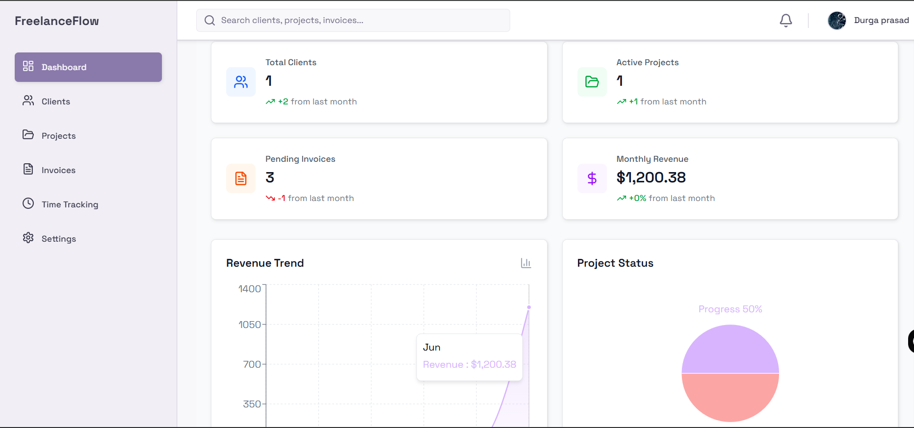
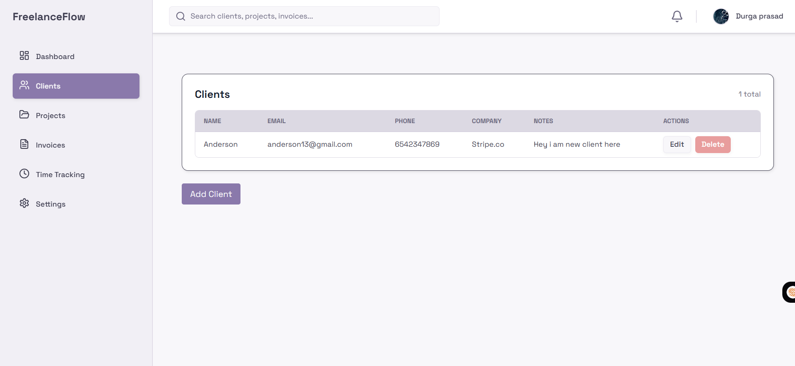
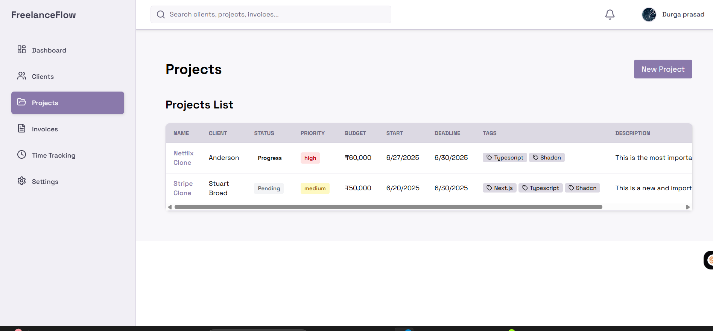
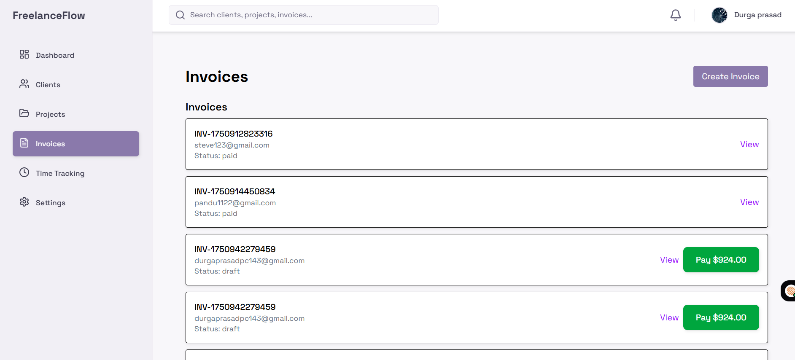
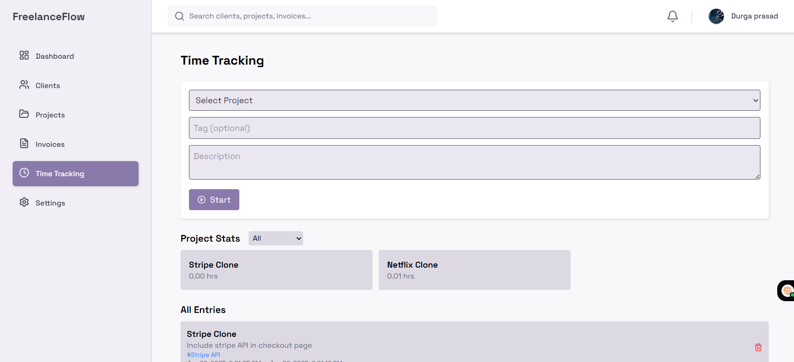

# 🚀 FreelanceFlow

**Modern Client Management Platform for Freelancers**

A full-stack web application built to demonstrate modern web development skills while solving real freelance business challenges. Features client management, project tracking, time logging, and invoice generation with Stripe integration.

[](https://freelance-flow-xi.vercel.app/)
[](https://github.com/Durga1534/Freelance_Flow)


## 📸 Screenshots

### Dashboard Overview

*Clean, intuitive dashboard with project and client insights*

### Client Management

*Complete client management with contact information and project history*

### Project Management

*Project tracking with progress monitoring and details*

### Invoice Generation

*Professional invoice generation with Stripe payment integration*

### Time Tracking

*Real-time project time tracking with detailed logging*

## ✨ Features

### 📊 **Dashboard**
- Real-time project and client overview
- Quick action buttons for common tasks
- Visual progress indicators
- Revenue and time tracking summaries

### 👥 **Client Management**
- Complete client profiles with contact details
- Project history per client
- Client status tracking

### 📋 **Project Management**
- Create and manage projects
- Track project progress and milestones
- Assign projects to clients
- Project status updates

### ⏱️ **Time Tracking**
- Start/stop timer for active projects
- Detailed time logs with descriptions
- Project-specific time categorization
- Time reporting and analytics

### 💰 **Invoice System**
- Professional invoice generation
- Stripe payment integration
- Invoice status tracking
- PDF invoice download

### 🔐 **Authentication**
- Secure user registration and login
- Protected routes and data
- Session management

## 🛠️ Technology Stack

### **Frontend**
- **Next.js 15** - React framework with App Router
- **TypeScript** - Type-safe development
- **Tailwind CSS** - Utility-first styling
- **Shadcn/UI** - Modern React component library
- **React Hook Form** - Form management and validation

### **Backend & Database**
- **Appwrite** - Backend-as-a-Service for database and auth
- **Next.js Server Actions** - Server-side logic
- **Zod** - Schema validation

### **Integrations**
- **Stripe** - Payment processing and invoice generation
- **Recharts** - Data visualization for analytics

### **Development Tools**
- **ESLint** - Code linting and formatting
- **Jest** - Unit testing setup
- **TypeScript** - Static type checking

## 🚀 Getting Started

### Prerequisites
- Node.js 18+ and npm
- Appwrite account and project
- Stripe account for payments

## 📘 Docs
- [🔐 Auth Flow](docs/auth-flow.md)


### Installation

```bash
# Clone the repository
git clone https://github.com/Durga1534/Freelance_Flow.git
cd Freelance_Flow

# Install dependencies
npm install

# Set up environment variables
cp .env.example .env.local
# Add your Appwrite and Stripe credentials

# Run development server
npm run dev

# Visit http://localhost:3000
```

### Environment Variables

```env
# Appwrite Configuration
NEXT_PUBLIC_APPWRITE_ENDPOINT=your_appwrite_endpoint
NEXT_PUBLIC_APPWRITE_PROJECT_ID=your_project_id
APPWRITE_API_KEY=your_api_key

# Stripe Configuration
NEXT_PUBLIC_STRIPE_PUBLISHABLE_KEY=your_stripe_public_key
STRIPE_SECRET_KEY=your_stripe_secret_key

# Application URL
NEXT_PUBLIC_APP_URL=http://localhost:3000
```

## 📦 Deployment

Deployed on Vercel with automatic deployments from the main branch.

```bash
# Build for production
npm run build

# Deploy to Vercel
vercel --prod
```

## 🧪 Testing

```bash
# Run tests
npm test

# Run tests in watch mode
npm run test:watch
```

## 🎯 Project Goals

This project was built to:
- Demonstrate full-stack development skills using modern technologies
- Solve real freelance business management challenges
- Practice integrating third-party services (Stripe, Appwrite)
- Build a production-ready application with proper authentication
- Showcase TypeScript and modern React patterns

## 💡 Key Learning Outcomes

- **Full-stack Development**: Built complete frontend and backend functionality
- **Payment Integration**: Implemented Stripe for invoice processing
- **Database Design**: Structured relational data with Appwrite
- **Authentication**: Secure user management and protected routes
- **TypeScript**: Type-safe development throughout the application
- **Modern React**: Hooks, Server Components, and state management
- **UI/UX Design**: Responsive design with Tailwind CSS and Shadcn/UI

## 🚧 Technical Challenges Solved

- Implementing real-time time tracking with start/stop functionality
- Integrating Stripe payment processing with invoice generation
- Building responsive dashboard with multiple data visualizations
- Managing complex state between clients, projects, and time entries
- Securing API routes and implementing proper authentication flows

## 👨‍💻 Author

**Durga Prasad Konduru**
- Portfolio: [Coming Soon]
- LinkedIn: [@durgaprasad23](https://www.linkedin.com/in/durgaprasad23)
- Email: kondurudurgaprasad.2@gmail.com

## 🤝 Contributing

Contributions, issues, and feature requests are welcome!

1. Fork the project
2. Create your feature branch (`git checkout -b feature/amazing-feature`)
3. Commit your changes (`git commit -m 'Add some amazing feature'`)
4. Push to the branch (`git push origin feature/amazing-feature`)
5. Open a Pull Request

<div align="center">
  <strong>Built with ❤️ to learn and grow as a developer</strong>
</div>
